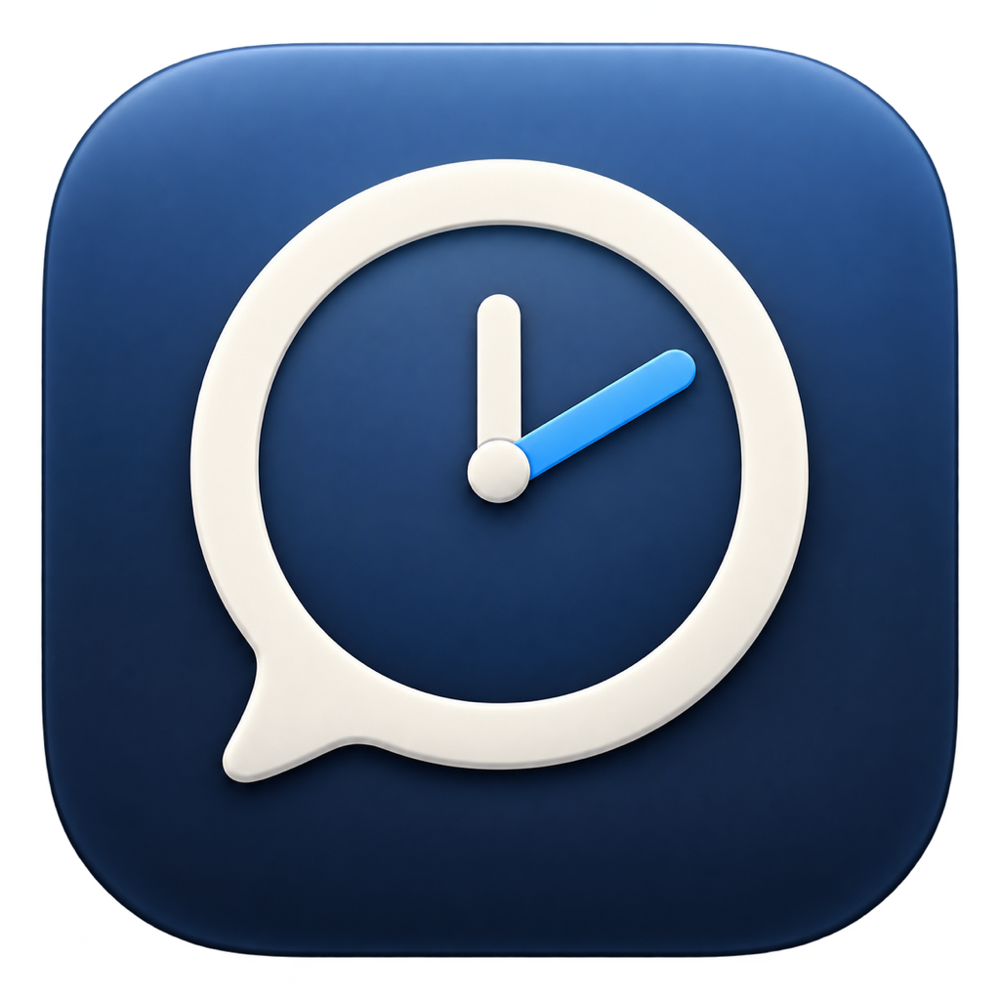

# Word Clock for macOS

<p align="center">
  
</p>

A small, native macOS menu-bar clock that writes the current time in words and keeps your calendar one click away.

## Highlights

- Speaks the time naturally, such as **“ten past four”** or **“quarter to five”**
- Shows a compact, browsable month calendar with optional ISO week numbers
- Opens Calendar on the selected day when you click a date
- Lists up to five upcoming Calendar events
- Opens Google Meet, Zoom, Microsoft Teams, Webex, and Whereby links directly
- Opens other events in the system Calendar app
- Can hide all-day events or events with fewer than two participants
- Supports exact-minute wording or five-minute rounding
- Optional weekday, lowercase text, configurable look-ahead, and launch at login
- Native “Check for Updates…” action in About, with automatic launch-time checks
- Uses AppKit, EventKit, ServiceManagement, SF Symbols, and native macOS materials
- Runs entirely in the menu bar with no Dock icon

<p align="center">
  
</p>

## Requirements

- macOS 14 Sonoma or newer
- Apple silicon or Intel Mac

## Download

Download the latest universal build from [GitHub Releases](https://github.com/AnandChowdhary/word-clock/releases/latest).

The downloadable build is ad-hoc signed rather than notarized. On first launch, macOS may require you to approve it in **System Settings → Privacy & Security**.

Word Clock uses [Sparkle](https://sparkle-project.org/) for secure updates. Automatic checks and automatic installation can be controlled independently in General settings.

## Build from source

Only Apple's Command Line Tools are required; a full Xcode installation is not necessary.

```sh
git clone https://github.com/AnandChowdhary/word-clock.git
cd word-clock
./scripts/build-app.sh
open outputs/WordClock.app
```

The build script produces a universal `arm64` and `x86_64` application in `outputs/WordClock.app`.

Run the formatter checks with:

```sh
./scripts/test.sh
```

## Calendar access and privacy

Calendar integration is optional. When enabled, Word Clock reads events locally through EventKit to populate the **Up Next** section. Calendar data is not transmitted or stored outside the system calendar database.

If an event contains a supported meeting URL in its URL, location, or notes, clicking it opens that link. Otherwise, clicking the event opens Calendar.

Clicking a day uses Calendar's native automation command to show that date. macOS may ask for permission to control Calendar the first time you use it.

## Project structure

```text
Sources/WordClock/    AppKit application source
Support/              App metadata and privacy descriptions
Tests/Runner/         Lightweight formatter checks
scripts/              Build and test scripts
assets/               README imagery
.github/workflows/     Signed release and appcast automation
```

## License

[MIT](LICENSE)
